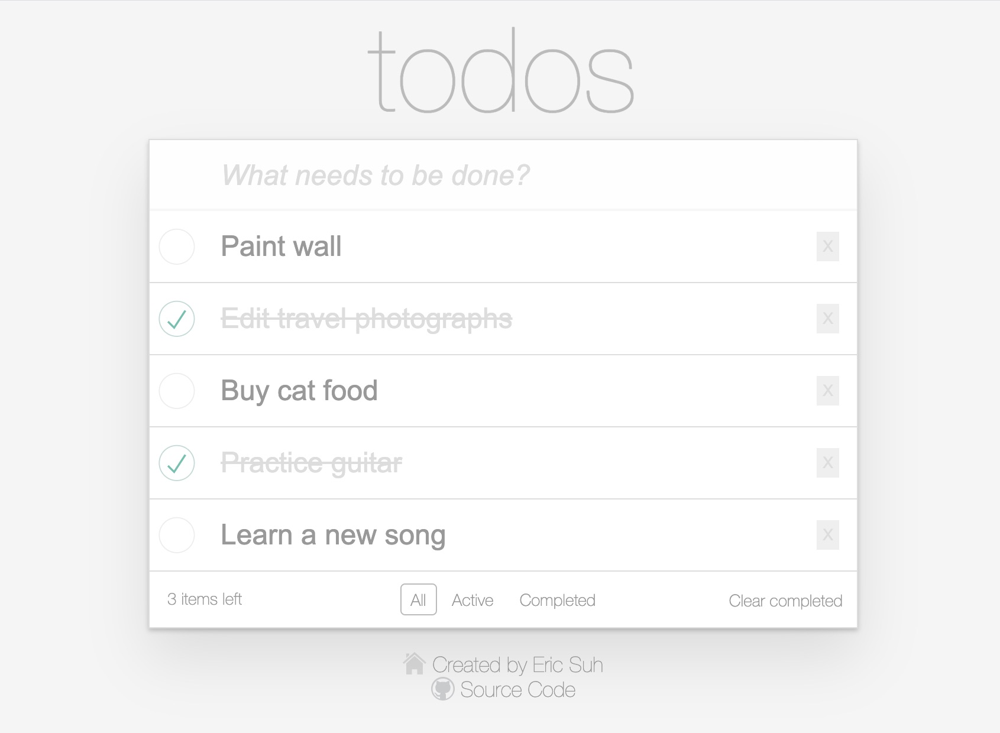

# todos
Customized starter app for using react + redux

## Screenshot


```
Todos.eric-suh.com

//
- React
- Redux (using redux-toolkit)
- Sass (/w resource loader for variables, mixins, etc)

//
- Webpack (bundler) + dev server
- Babel (transpiler)
- Eslint (extending airbnb's eslint rules)
- Stylelint
- Husky/Lint-staged
```
## Features

* Based on the Todo-MVC site. 
* Included additional keyboard navigation function.
* Fully responsive design.

